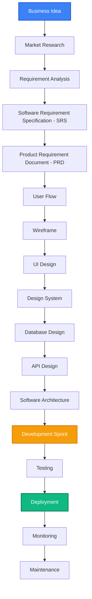

#  DevFlow — Website Monitoring Progress SDLC

<div align="center">

  <!-- Logo Placeholder -->
  

  <p><strong>Aplikasi Monitoring Progress Pengembangan Software Berbasis Alur Kerja SDLC Modern & Minimalis</strong></p>

  <!-- Badges -->
  [](https://nextjs.org/)
  [](https://www.typescriptlang.org/)
  [](https://tailwindcss.com/)
  [](https://opensource.org/licenses/MIT)

  <!-- Screenshot Placeholder -->
  

</div>

---

## 📖 Tentang Proyek

**DevFlow** adalah website pemantauan progress pengembangan perangkat lunak yang dirancang untuk membantu Software Engineers, Product Managers, dan Stakeholders melacak siklus hidup software secara terstruktur.

Aplikasi ini beroperasi sepenuhnya secara **client-side (static website)** tanpa ketergantungan pada server backend, database eksternal, atau sistem autentikasi kompleks. Pelacakan tahapan didasarkan pada siklus **Software Development Life Cycle (SDLC)**, mulai dari perumusan ide awal hingga pemeliharaan sistem jangka panjang. Seluruh data proyek, catatan, dan progres checklist disimpan langsung di browser pengguna untuk kenyamanan instan dan kepatuhan privasi.

---

## ✨ Fitur Utama

- **📊 Dashboard Project**: Menyajikan ringkasan proyek aktif, batas waktu (deadline), penanggung jawab, skala prioritas, dan progress keseluruhan.
- **📍 SDLC Timeline**: Jalur timeline vertikal interaktif yang melacak 17 tahapan alur kerja pengembangan software.
- **📈 Progress Tracking**: Persentase progress dihitung secara otomatis berdasarkan rasio checklist tugas yang diselesaikan.
- **☑️ Interactive Checklist**: Butir checklist pekerjaan pada setiap tahap yang dapat dicentang, ditambahkan, atau dihapus secara dinamis.
- **📝 Notes & Remarks**: Bidang teks catatan per tahap yang terintegrasi dengan fitur penyimpanan otomatis (*auto-save*).
- **🔋 Statistics Card**: Ringkasan data kuantitatif yang menunjukkan total tahap, jumlah tahap selesai, sedang berjalan, dan belum dimulai.
- **📱 Responsive Design**: Antarmuka responsif yang disesuaikan untuk kenyamanan penggunaan di perangkat seluler, tablet, dan desktop.
- **🌙 Dark & Light Mode**: Skema warna modern minimalis bergaya Vercel & Linear dengan transisi yang halus.
- **💾 Local Storage Persistence**: Penyimpanan data instan di sisi client yang menjaga data Anda tetap aman saat halaman dimuat ulang.
- **⚡ Static Website & Ready to Deploy**: Siap dideploy ke layanan hosting statis seperti Vercel, Netlify, atau GitHub Pages tanpa konfigurasi server tambahan.

---

## 🔄 SDLC Workflow

Alur kerja pengembangan di dalam aplikasi mengikuti 17 tahapan standar industri berikut secara berurutan:



---

## 🛠️ Tech Stack

| Teknologi | Kategori | Fungsi |
| :--- | :--- | :--- |
| **Next.js / React** | Framework Frontend | Kerangka kerja rendering UI & Router |
| **TypeScript** | Bahasa Pemrograman | Keamanan tipe data statis & kejelasan kode |
| **Tailwind CSS** | Styling (CSS) | Kerangka CSS utilitas untuk desain modern dan responsif |
| **shadcn/ui** | Komponen UI | Reusable component bergaya minimalis & premium |
| **Lucide Icons** | Perpustakaan Ikon | Penyedia set ikon vektor clean & informatif |
| **Framer Motion** | Animasi | Animasi mikro untuk transisi halaman dan elemen |

---

## 📂 Folder Structure

Berikut adalah struktur direktori proyek yang terorganisir:

```text
src/
├── components/         # Komponen UI Reusable (Navbar, Sidebar, Checklist, dll.)
├── data/               # File JSON penyimpan dummy data proyek awal (projects.json)
├── pages/              # Halaman dashboard dan navigasi utama
├── styles/             # Stylesheet utama & kustomisasi tokens CSS
├── public/             # Aset statis (ikon, gambar, ilustrasi)
├── types/              # Deklarasi tipe data TypeScript (interfaces)
├── App.tsx             # Entry point komponen inti dan manajemen state
└── main.tsx            # Poin eksekusi React DOM render
```

---

## 💻 Panduan Instalasi

Ikuti langkah-langkah di bawah ini untuk menjalankan proyek di komputer lokal Anda:

1. **Clone Repositori**
   ```bash
   git clone <repository-url>
   ```
2. **Masuk ke Direktori Proyek**
   ```bash
   cd project
   ```
3. **Instalasi Dependensi**
   ```bash
   npm install
   ```
4. **Jalankan Development Server**
   ```bash
   npm run dev
   ```
   Buka [http://localhost:3000](http://localhost:3000) (atau port yang tertera pada terminal Anda) untuk melihat aplikasi.

---

## 📦 Build untuk Produksi

Untuk mengompilasi proyek menjadi kode produksi HTML, CSS, dan JS statis yang optimal:

```bash
npm run build
```
Hasil kompilasi akan berada di folder `dist/` (atau `.next/` jika menggunakan Next.js export).

---

## 🚀 Panduan Deployment

### Deploy ke Vercel (Rekomendasi)
1. Buat akun di [Vercel](https://vercel.com).
2. Hubungkan akun GitHub Anda dan pilih repositori proyek ini.
3. Vercel akan mendeteksi pengaturan proyek secara otomatis.
4. Klik tombol **Deploy**.

### Deploy ke GitHub Pages
1. Pastikan Anda mengonfigurasi base path di konfigurasi bundler (misalnya `vite.config.ts` atau `next.config.js`) jika nama repositori Anda bukan domain utama (misal: `https://username.github.io/nama-repo/`).
2. Instal paket `gh-pages` jika diperlukan, atau buat GitHub Actions workflow untuk otomatisasi build dan deploy.
3. Push kode Anda ke branch `gh-pages` atau direktori `/docs` di branch utama Anda.

---

## ⚙️ Konfigurasi Data

Aplikasi ini bekerja sepenuhnya di sisi klien:
- **Awal Mula Data**: Data dasar proyek didefinisikan secara statis di dalam file `src/data/projects.json`.
- **Modifikasi Pengguna**: Ketika pengguna mengubah status checklist, menambahkan tugas, menulis catatan, atau mengubah profil proyek, data hasil pembaruan langsung disimpan ke **Local Storage** browser dengan nama key `devflow_projects`.

---

## 📸 Screenshots (Placeholder)

Berikut adalah visualisasi antarmuka utama dari aplikasi:

| Dashboard Overview | Vertikal Timeline & Checklist |
| :--- | :--- |
|  |  |

| Checklist Mode | Dark Mode & Mobile View |
| :--- | :--- |
|  |  |

---

## 🗺️ Roadmap Pengembangan

Rencana penambahan fitur di masa mendatang untuk mengubah aplikasi statis ini menjadi platform kolaboratif:

- [ ] 🔐 **Sistem Login**: Integrasi dengan layanan OAuth (Google, GitHub) atau email/password.
- [ ] 🖥️ **Backend Server**: Sinkronisasi data multi-user menggunakan REST atau GraphQL API.
- [ ] 🗄️ **Database Integration**: Menyimpan data proyek di database cloud (PostgreSQL, MongoDB).
- [ ] 📁 **File Upload**: Kemampuan untuk mengunggah berkas asli secara langsung (bukan sekadar daftar nama dokumen).
- [ ] 👥 **Kolaborasi Tim**: Berbagi proyek, menugaskan anggota tim pada tahap tertentu, dan komentar real-time.
- [ ] 🔔 **Notifikasi**: Pemberitahuan email/browser untuk deadline dan pembaruan penting.
- [ ] 📅 **Kalender Integrasi**: Tampilan deadline dalam bentuk kalender bulanan/mingguan.
- [ ] 📊 **Gantt Chart**: Visualisasi rentang waktu tahapan SDLC yang interaktif untuk proyek skala besar.

---

## 🤝 Kontribusi

Kontribusi selalu diterima dengan tangan terbuka! Jika Anda memiliki ide atau perbaikan bug:

1. Lakukan **Fork** pada repositori ini.
2. Buat branch fitur baru Anda (`git checkout -b fitur/FiturKeren`).
3. Lakukan commit pada perubahan Anda (`git commit -m 'Menambahkan fitur keren'`).
4. Push ke branch tersebut (`git push origin fitur/FiturKeren`).
5. Buat **Pull Request** baru di GitHub.

---

## 📄 License

Proyek ini dilisensikan di bawah lisensi MIT - lihat file [LICENSE](LICENSE) untuk detail lebih lanjut.

---

## 👤 Author

* **Nama Lengkap** - *Software Engineer*
* GitHub: [@yourusername](https://github.com/yourusername)
* LinkedIn: [yourprofile](https://linkedin.com/in/yourprofile)
* Website: [yourwebsite.com](https://yourwebsite.com)
